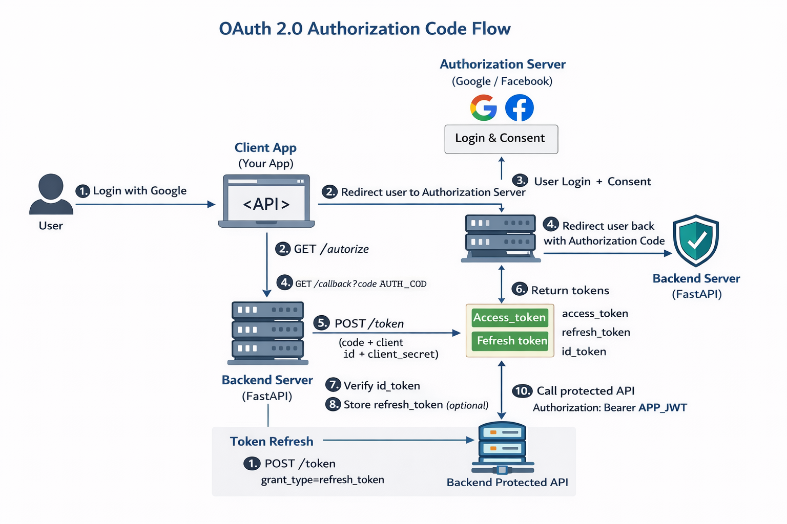

# OAuth2 Login (Google/Facebook)

---

## 🧠 High-Level Model

```
Google/Facebook  →  Confirms Identity
FastAPI          →  Creates User + Issues JWT
Client           →  Uses JWT to call APIs
```

---

## 🔁 COMPLETE DIRECTIONAL FLOW

---

## STEP 1️⃣ User clicks “Login with Google”

```
User → Frontend
```

Frontend redirects browser to OAuth provider:

```
GET https://accounts.google.com/authorize
    ?client_id=XXX
    &redirect_uri=/callback
    &response_type=code
    &scope=openid email profile
```

📌 Backend NOT involved yet
📌 No user exists in DB yet

---

## STEP 2️⃣ OAuth Provider authenticates user

```
User → Google/Facebook
```

* User logs in
* User gives consent

---

## STEP 3️⃣ Authorization Server redirects back with CODE

```
Google → Browser → FastAPI
GET /callback?code=AUTH_CODE
```

📌 **Authorization Code ≠ Token**
📌 Code is short-lived and one-time

---

## STEP 4️⃣ Backend exchanges code for tokens

```
FastAPI → Google Token Endpoint
POST /token
```

Backend sends:

* authorization code
* client_id
* client_secret
* redirect_uri

---

## STEP 5️⃣ OAuth Provider returns tokens

```json
{
  "id_token": "...",
  "access_token": "...",
  "refresh_token": "...",
  "expires_in": 3600
}
```

### Token Meaning:

| Token         | Purpose                             |
| ------------- | ----------------------------------- |
| id_token      | **Identity proof (MOST IMPORTANT)** |
| access_token  | Call Google/Facebook APIs           |
| refresh_token | Get new provider tokens             |

---

## STEP 6️⃣ Backend verifies `id_token`

FastAPI verifies:

* Signature
* Issuer
* Audience
* Expiry

Extracts user identity:

```json
{
  "sub": "google-unique-id",
  "email": "user@gmail.com",
  "name": "User Name"
}
```

📌 This proves **who the user is**

---

## STEP 7️⃣ Just-In-Time User Creation (NO REGISTRATION)

```python
user = find_user(provider="google", provider_id=sub)

if not user:
    user = create_user(
        email=email,
        name=name,
        provider="google",
        provider_user_id=sub
    )
```

✅ First OAuth login = Registration
❌ No password
❌ No signup form

---

## STEP 8️⃣ Backend issues its OWN JWT 🔐

Backend creates JWT:

```json
{
  "user_id": 42,
  "email": "user@gmail.com",
  "role": "user"
}
```

📌 This JWT represents:

> “User is authenticated in **MY SYSTEM**”

---

## STEP 9️⃣ Client uses Backend JWT for all requests

```
Client → FastAPI
Authorization: Bearer <YOUR_JWT>
```

FastAPI verifies JWT locally:

* No Google calls
* Fast
* Stateless

---

## STEP 🔁 Token Refresh (Backend Controlled)

When JWT expires:

```
Client → /refresh
```

Backend:

* validates refresh token
* issues new JWT

📌 OAuth provider NOT involved

---

## ✅ WHEN TO USE OAUTH PROVIDER ACCESS TOKEN

Use it **ONLY IF** your backend needs provider APIs:

* Google Calendar
* Google Drive
* Facebook Graph API

Otherwise:
❌ Don’t store it
❌ Don’t refresh it

---

📌 No password field
📌 Supports multi-provider login

---

## 🧠 Ultra-Simple Analogy (Memorable)

* **OAuth Login** → Passport (Identity)
* **JWT** → Boarding Pass (Access)

You don’t show your passport at every gate ✈️

---

## 🏆 FINAL ANSWER

> *OAuth2 is used to authenticate users via trusted providers. After verifying the identity using the ID token, the backend performs just-in-time user creation and issues its own JWT, which is then used to authorize all API requests.*

---



