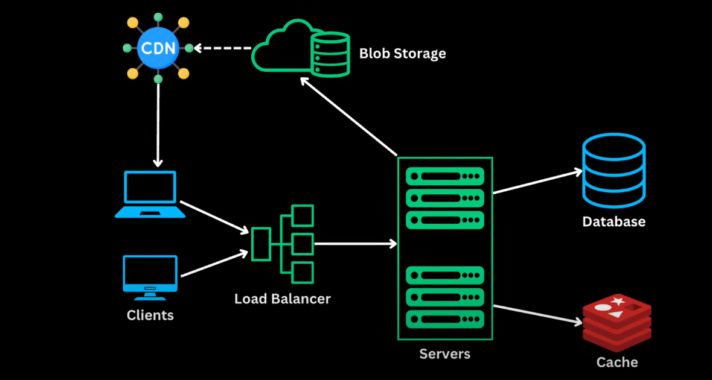

## 🌐 **Full Workflow: From Request to Response**

```
👨‍💻 1. User Opens Website (e.g., www.mysite.com)
   │
   └──> DNS resolves domain to CDN edge server
             ▼

📡 2. CDN (Content Delivery Network)
   │
   ├──> Checks cache for static assets (HTML, CSS, JS, images)
   ├──> ✅ If cached → Return to user instantly
   └──> ❌ If not cached → Fetch from Blob Storage or origin server
             ▼

🖥️ 3. Client Browser Loads Page
   │
   └──> For dynamic content (e.g., product details, user profile)
         sends API request (AJAX/Fetch/XHR) to backend via public endpoint
             ▼

🎛️ 4. Load Balancer (NGINX / AWS ELB / HAProxy)
   │
   ├──> Accepts incoming API request
   ├──> Runs health checks on backend servers
   └──> Forwards request to optimal backend server
             ▼

🧠 5. Backend Server (e.g., FastAPI / Django / Node.js)
   │
   ├──> Parses request
   ├──> Authenticates user (JWT/session/cookies)
   └──> Business logic triggered (e.g., get product info)
             ▼

⚡ 6. Cache Lookup (Redis / Memcached)
   │
   ├──> 🔍 Check if the requested data is cached
   ├──> ✅ If found → Return data directly (faster)
   └──> ❌ If not found → Query database
             ▼

🗄️ 7. Database Query (PostgreSQL / MySQL / MongoDB)
   │
   ├──> Fetch required data (e.g., product, user orders)
   └──> Return result to backend server
             ▼

🧠 8. Backend Server (Continue)
   │
   ├──> Stores fresh result in cache for future
   ├──> If needed, fetches media links from Blob Storage
   └──> Prepares response (JSON, HTML, etc.)
             ▼

🪣 9. Blob Storage Access (S3 / Azure Blob / GCP)
   │
   ├──> Used only if image/video/file requested is not served via CDN
   └──> Returns media URL or binary to server or CDN
             ▼

📤 10. Response Sent to Load Balancer
   │
   └──> Load balancer passes it back to client
             ▼

🖥️ 11. Final Response Delivered to Client
   │
   ├──> User sees dynamic content (products, profile, dashboard)
   └──> Media served via CDN/Blob — fast and global
```


## 🔄 **Request - Response Workflow (CDN, Load Balancer, Cache, Blob Storage)**

### 1. **🌐 Client Requests a Page**

* **What happens**: A user opens the website (e.g., `www.amazon.com`) in a browser.
* **In the diagram**: The request starts from **Clients**.
* **Example**: User wants to view a product page.

---

### 2. **📡 CDN Delivers Static Assets**

* **What happens**: The CDN (Content Delivery Network) serves static assets (images, CSS, JS) closest to the user for faster loading.
* **In the diagram**: Clients hit **CDN**, which is connected to **Blob Storage**.
* **Example**: Product image, site CSS, and JS are loaded quickly from nearby CDN edge server.

---

### 3. **↪️ Request Sent to Load Balancer**

* **What happens**: The user's request for dynamic content (like product details) goes to a **Load Balancer**.
* **In the diagram**: Client → Load Balancer.
* **Example**: The request to fetch product description and price is sent to the load balancer.

---

### 4. **🖥️ Load Balancer Routes to Servers**

* **What happens**: Load balancer distributes requests to the healthiest and least busy **application server**.
* **In the diagram**: Load Balancer → Servers.
* **Example**: The load balancer sends your request to Server 3, which is available.

---

### 5. **⚡ Cache Layer is Checked First**

* **What happens**: Server checks **Cache** (e.g., Redis) for recently accessed product details.
* **In the diagram**: Servers ↔ Cache.
* **Example**: If someone recently viewed the same product, its info is in cache → served instantly.

---

### 6. **📂 If Not in Cache, Query the Database**

* **What happens**: If data isn’t cached, server queries the main **Database** (e.g., MySQL/PostgreSQL).
* **In the diagram**: Servers → Database.
* **Example**: Server fetches the latest price, stock, reviews from the product table.

---

### 7. **📝 Store Data in Cache for Next Time**

* **What happens**: After getting data from the database, server stores it in **Cache** to speed up future requests.
* **Example**: Product data is now cached for 10 mins → next user gets faster response.

---

### 8. **💾 Blob Storage Used for Media**

* **What happens**: Product images, videos, PDFs are stored in **Blob Storage** (e.g., AWS S3).
* **In the diagram**: Servers ←→ Blob Storage, and CDN also pulls from Blob Storage.
* **Example**: Product video stored in S3 is linked in the product page.

---

### 9. **📤 Server Sends Response Back to Client**

* **What happens**: Server compiles all data (HTML + media links) and sends it back to the user.
* **In the diagram**: Servers → Load Balancer → Clients.
* **Example**: User sees full product page, images, prices, stock, and reviews.

---