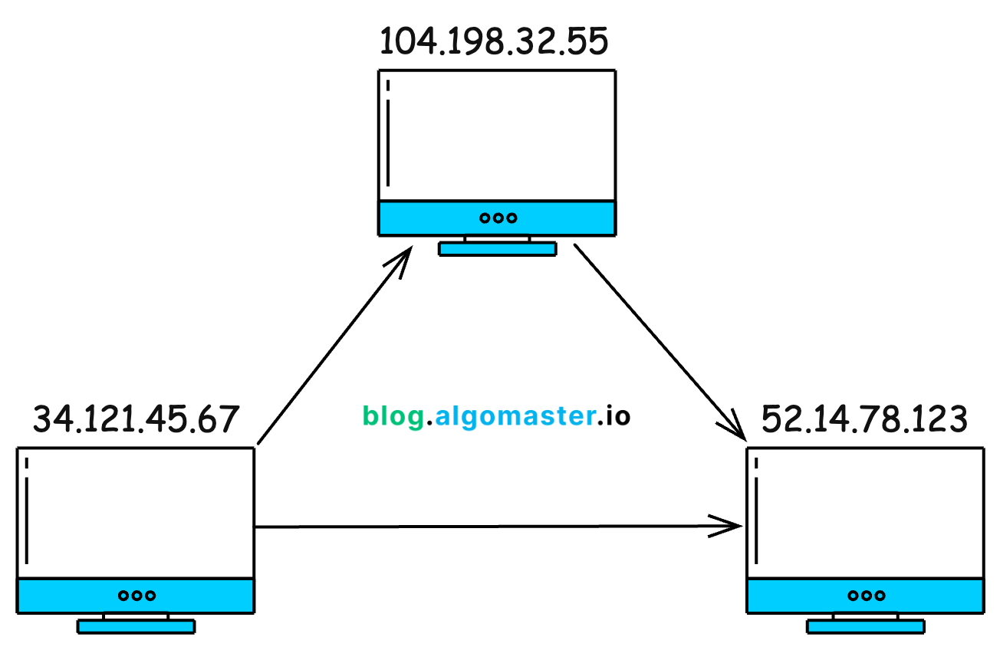
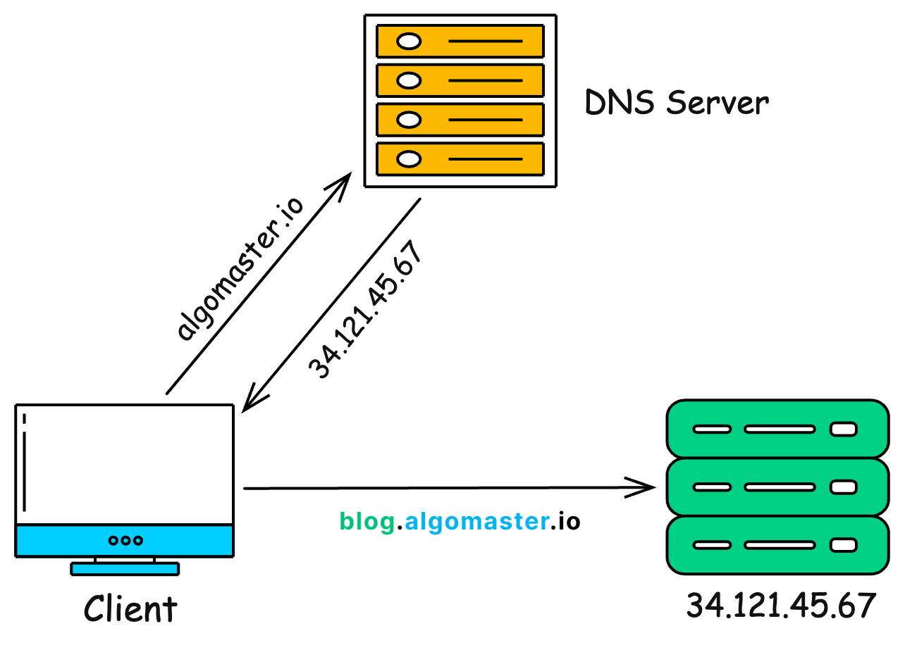
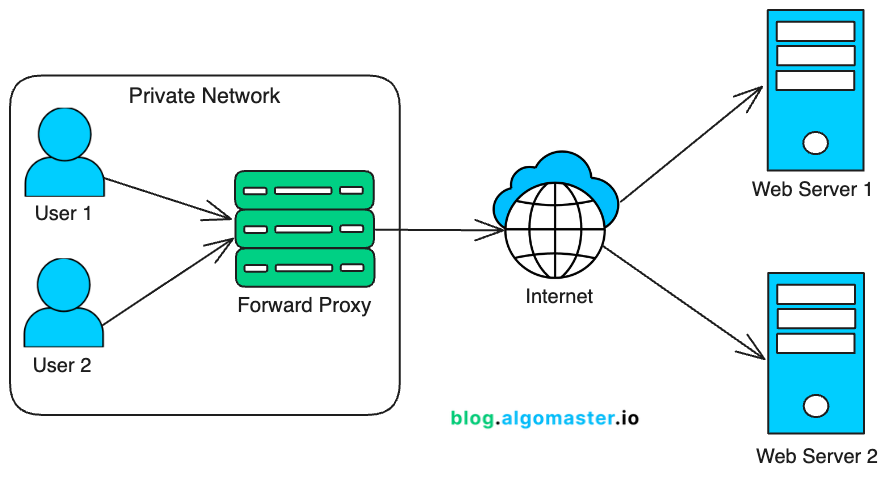
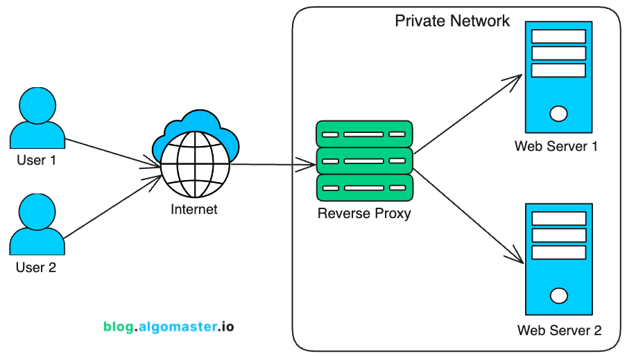
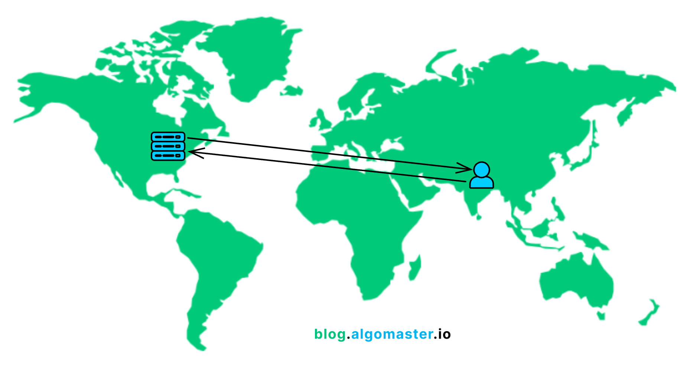
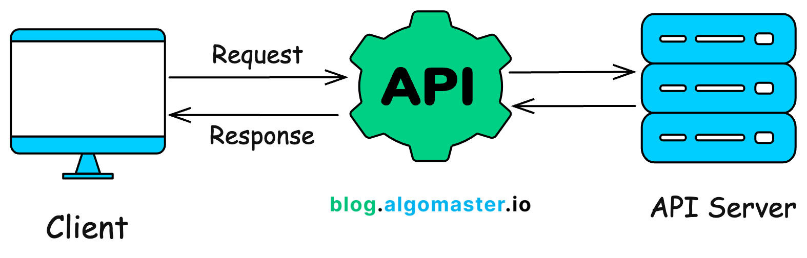
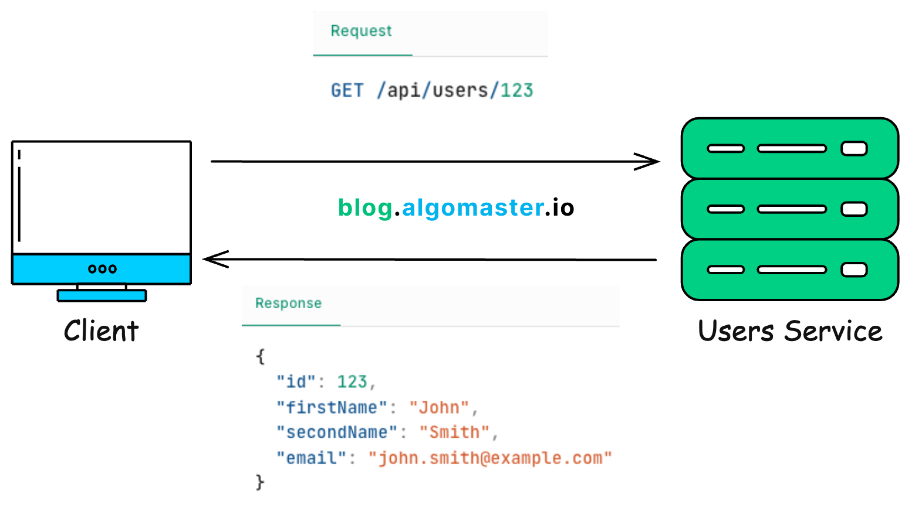
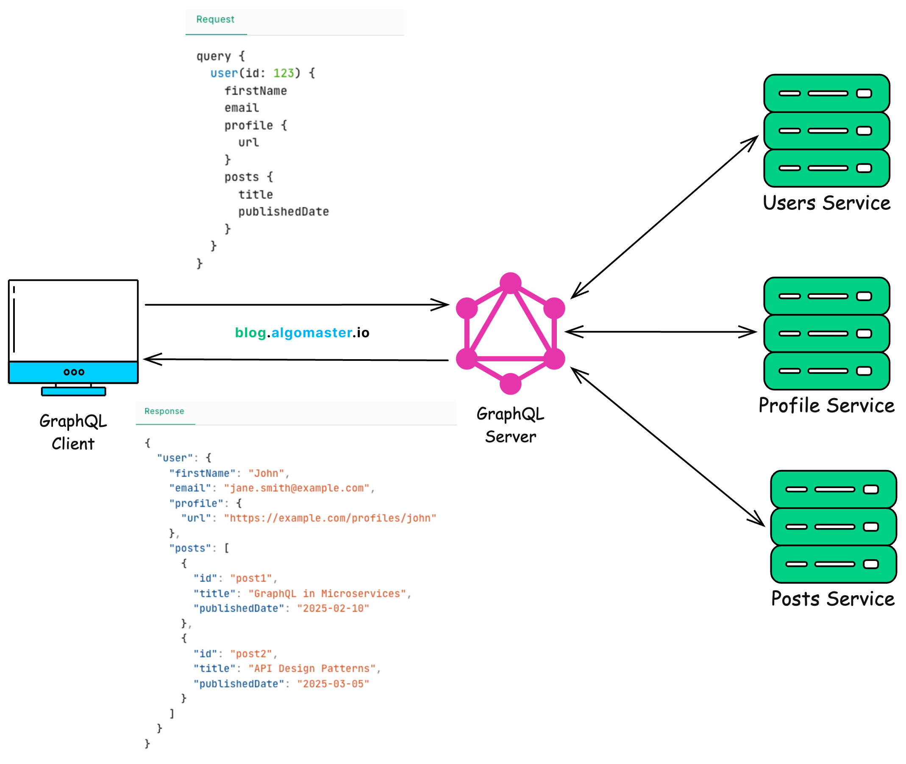
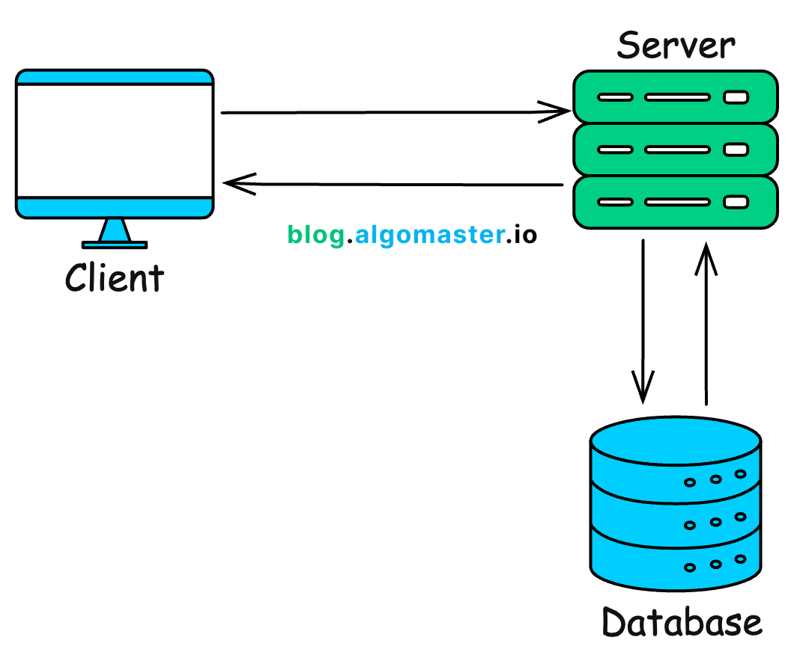
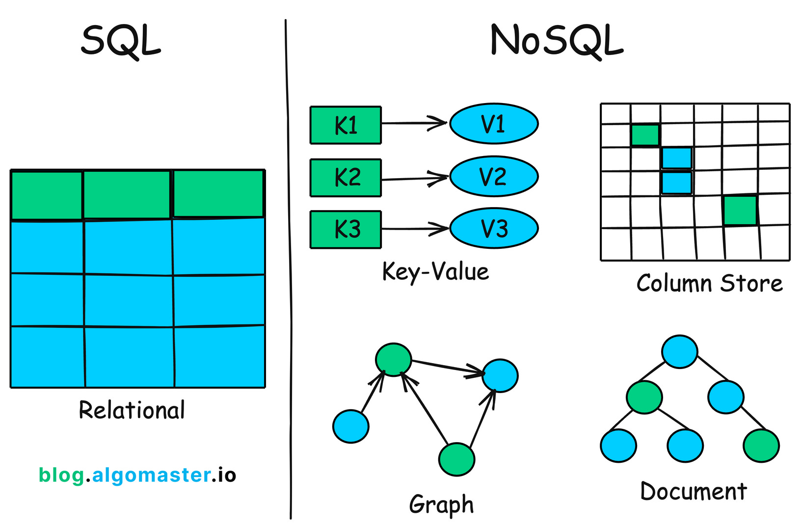

# 🧠 **System Design – Core Knowledge Map**

---

## ✅ 1. **Core Concepts**

| Concept                          | Description                                                                |
| -------------------------------- | -------------------------------------------------------------------------- |
| **Client-Server Model**          | Communication model between clients and centralized servers                |
| **REST vs. RPC vs. GraphQL**     | API communication styles and trade-offs                                    |
| **Microservices vs. Monoliths**  | Architecture patterns and scalability implications                         |
| **Sync vs. Async Communication** | Blocking vs. non-blocking data flows                                       |
| **Stateless vs. Stateful**       | Session management and implications on scaling                             |
| **Service Discovery**            | Dynamic detection of service locations (e.g., Consul, Eureka)              |
| **Load Balancing**               | Distributes traffic across services (e.g., Round-robin, Least Connections) |

---

## ✅ 2. **Scalability**

| Concept                             | Description                                                |
| ----------------------------------- | ---------------------------------------------------------- |
| **Horizontal vs. Vertical Scaling** | Scaling out vs. scaling up                                 |
| **Load Balancers**                  | Tools like **NGINX**, **HAProxy** for traffic distribution |
| **Sticky Sessions**                 | Maintain session affinity with specific servers            |
| **Sharding & Partitioning**         | Split data across databases/servers                        |
| **CDNs**                            | Cache static assets near the user for faster access        |

---

## ✅ 3. **Data Management**

| Concept                           | Description                                                              |
| --------------------------------- | ------------------------------------------------------------------------ |
| **SQL vs. NoSQL**                 | Relational (MySQL/PostgreSQL) vs. Document/Key-Value (MongoDB, DynamoDB) |
| **CAP Theorem**                   | Trade-off between Consistency, Availability, and Partition Tolerance     |
| **Replication**                   | Copying data across nodes for fault tolerance                            |
| **Eventual Consistency**          | Relaxed consistency model in distributed systems                         |
| **Indexing & Query Optimization** | Improve DB performance through optimized indexing                        |
| **Caching Strategies**            | Read-through, Write-through, Write-back strategies                       |

---

## ✅ 4. **Caching**

| Concept                | Description                         |
| ---------------------- | ----------------------------------- |
| **Caching Tools**      | **Redis**, **Memcached**            |
| **Cache Invalidation** | Strategies to keep cache fresh      |
| **Eviction Policies**  | **TTL**, **LFU**, **LRU**, **FIFO** |
| **CDN Edge Caching**   | Cache content at the network edge   |

---

## ✅ 5. **Message Queues & Async Processing**

| Concept                      | Description                                             |
| ---------------------------- | ------------------------------------------------------- |
| **Message Brokers**          | **RabbitMQ**, **Kafka**, **AWS SQS**                    |
| **Pub/Sub Pattern**          | Publisher-subscriber model for events                   |
| **Task Queues**              | Tools like **Celery**, **Dramatiq** for background jobs |
| **Dead Letter Queues (DLQ)** | Handle failed or undelivered messages                   |

---

## ✅ 6. **High Availability & Fault Tolerance**

| Concept                  | Description                                              |
| ------------------------ | -------------------------------------------------------- |
| **Redundancy**           | Multiple instances to eliminate single points of failure |
| **Failover Mechanisms**  | Auto-switch to backup services                           |
| **Health Checks**        | Monitor service uptime                                   |
| **Auto Healing**         | Restart failed services automatically                    |
| **Graceful Degradation** | Maintain partial functionality on failure                |

---

## ✅ 7. **System Performance & Optimization**

| Concept                          | Description                                                    |
| -------------------------------- | -------------------------------------------------------------- |
| **Rate Limiting / Throttling**   | Control API usage per user/client                              |
| **Bulkhead Pattern**             | Isolate failures in a subset of the system                     |
| **Backpressure Handling**        | Prevent overload by signaling producers                        |
| **API Profiling / Benchmarking** | Measure performance using tools like Postman, Apache Benchmark |

---

## ✅ 8. **Security**

| Concept                | Description                                   |
| ---------------------- | --------------------------------------------- |
| **Authentication**     | OAuth2, JWT, API Keys                         |
| **Authorization**      | RBAC, ABAC models                             |
| **Transport Security** | HTTPS, TLS                                    |
| **Common Threats**     | SQL Injection, CSRF, XSS                      |
| **DDoS Protection**    | Rate limiting, Web Application Firewall (WAF) |
| **Encryption**         | Data encryption at rest & in transit          |

---

## ✅ 9. **API Design & Gateways**

| Concept                  | Description                                              |
| ------------------------ | -------------------------------------------------------- |
| **API Specs**            | **OpenAPI / Swagger**                                    |
| **API Versioning**       | URI-based or Header-based version control                |
| **API Gateway**          | **Kong**, **AWS API Gateway** for routing and protection |
| **Rate Limiting & Auth** | Centralized control at gateway level                     |
| **Circuit Breakers**     | Prevent cascading failures (e.g., Netflix Hystrix)       |

---

## ✅ 10. **Observability**

| Concept        | Description                                                         |
| -------------- | ------------------------------------------------------------------- |
| **Monitoring** | **Prometheus**, **Grafana**, **CloudWatch**                         |
| **Logging**    | **ELK Stack**, **Loki**                                             |
| **Tracing**    | **Jaeger**, **Zipkin**, **OpenTelemetry**                           |
| **Alerting**   | On-call alerts with PagerDuty, Opsgenie, or Prometheus AlertManager |

---

## ✅ 11. **Design Patterns & Principles**

| Concept                       | Description                              |
| ----------------------------- | ---------------------------------------- |
| **12-Factor App**             | Modern web app development principles    |
| **Repository Pattern**        | Abstract DB access                       |
| **Dependency Injection**      | Decouple component dependencies          |
| **Classic Patterns**          | Singleton, Factory, Adapter, etc.        |
| **Event-driven Architecture** | Reactive systems powered by events       |
| **CQRS**                      | Command Query Responsibility Segregation |
| **Saga Pattern**              | Handle distributed transactions reliably |

---

## ✅ 12. **Distributed Systems Concepts**

| Concept                  | Description                                                  |
| ------------------------ | ------------------------------------------------------------ |
| **Consensus Algorithms** | Raft, Paxos for leader election                              |
| **Leader Election**      | Ensures coordination in clusters                             |
| **Distributed Locks**    | **Redis**, **ZooKeeper** for critical section control        |
| **Quorum**               | Minimum required nodes for consistency                       |
| **Logical Clocks**       | **Vector Clocks**, **Lamport Timestamps** for event ordering |

---

## ✅ 13. **CI/CD & Deployment**

| Concept                   | Description                                              |
| ------------------------- | -------------------------------------------------------- |
| **Docker & Compose**      | Containerize and manage services                         |
| **Kubernetes**            | Orchestrate and scale containers                         |
| **Helm**                  | K8s package manager                                      |
| **CI/CD Tools**           | GitHub Actions, GitLab CI, Jenkins                       |
| **Deployment Strategies** | Blue-Green, Canary Deployments                           |
| **IaC**                   | **Terraform**, **CloudFormation** for reproducible infra |

---

## ✅ 14. **Cloud Services Knowledge**

| Concept               | Description                                     |
| --------------------- | ----------------------------------------------- |
| **Cloud Platforms**   | **AWS**, **GCP**, **Azure**                     |
| **Core Services**     | EC2, S3, RDS, Lambda, API Gateway, SQS, SNS     |
| **Networking**        | VPC, Subnetting, Security Groups                |
| **Serverless Design** | Pay-per-execution via Lambda/Firebase Functions |

---

### 🧱 1. **Client-Server Architecture**


* Mobile app or browser acts as the **client**.
* Backend service (Node.js, Django, FastAPI) is the **server**.
* When a user logs in, the client sends a request to `/login`, and the server processes credentials and returns a session token.

---

### 🌐 2. **IP Address**



* Every server is hosted on a unique IP (e.g., `18.162.0.1` for AWS).
* DNS (like Route53) maps `www.example.com` to this IP so users don’t need to remember it.

---

### 🌍 3. **DNS (Domain Name System)**



It’s like your phone’s **contact list**, but for websites.

Instead of remembering IP numbers like `123.45.67.89`, you just type a name like `google.com`.

1. **You type:** `algomaster.io`
2. **Computer asks DNS:** “What’s the IP of algomaster.io?”
3. **DNS replies:** “It’s 123.45.67.89”
4. **Browser connects** to that IP and opens the website.


**Open terminal and type:**

`ping algomaster.io`

---

### 🧰 4. **Proxy / Reverse Proxy**

**🧑‍💻 What is a **Proxy**?**



💬 Real-Life Example:

Imagine you want to ask a question in class but feel shy 😅

So you tell your friend to ask it for you.
Your **friend is the proxy** — asking on your behalf.

---

🌐 Internet Version:

You → **Proxy Server** → Website

* You tell the proxy: "Get me `google.com`"
* The proxy goes to `google.com`, gets the data
* Then it brings it back to you

🛡️ **Why use it?**

* Hides **your identity/IP**
* Bypasses blocks (e.g., accessing blocked sites)
* Used in schools/offices to monitor or restrict websites

---

**🔁 What is a **Reverse Proxy**?**



💬 Real-Life Example:

Imagine a company has many departments: Support, Sales, HR.

Visitors don’t know which department to go to — they talk to the **receptionist**.

The **receptionist (reverse proxy)** listens and sends them to the right department.

---

🌐 Internet Version:

Visitor → **Reverse Proxy** → Backend Server

* You open `amazon.com`
* The reverse proxy receives your request
* It decides:

  * Which **server** to send you to
  * Whether to allow you or block you
* Gets the response and sends it back to you

🛡️ **Why use it?**

* Protects real servers (you can’t see them)
* Blocks bad traffic (like hackers or bots)
* Balances traffic (if 1 server is busy, sends to another)
---

### 🕐 5. **Latency**

**🕒 What is **Latency**?**


**Latency** = **Delay**
It’s the **time it takes** for data to go from **you (client)** to a **server**, and come back.

---

💬 Real-Life Example

Imagine shouting to a friend across the street:

* You yell: “Hey!”
* Your friend hears it and yells back: “What?”

⏱️ The time between you yelling and hearing the reply — that’s **latency**.

If your friend is far away (or on the other side of the world), it takes longer. That’s **higher latency**.

---

🌍 Internet Example

Let’s say:

* 🧑 You are in **India**
* 🌐 The server is in **New York**

What happens:

```
You → Request → New York Server
New York Server → Response → You
```

This round-trip takes **time** because data travels through cables, satellites, routers... over thousands of kilometers!

That delay is called **latency**.

---

🐢 Why High Latency Feels Bad

* Slow website loading
* Delays in video calls or online games
* Lag in live apps like stock trading or chatting

---

🚀 How to Reduce Latency

✅ Use **CDNs (Content Delivery Networks)**
✅ Deploy servers in **multiple locations (data centers)**
✅ Let users connect to the **nearest server**

---

🗺️ Flow: High vs Low Latency

🌍 Without nearby server (High Latency):

```
[ User in India ]
       ↓
[ Server in New York ]
       ↓
   (Long trip = Slow)
```

🏢 With nearby server (Low Latency):

```
[ User in India ]
       ↓
[ Server in Mumbai ]
       ↓
   (Short trip = Fast)
```

---

### 🔐 6. **HTTP/HTTPS**

**🌐 What is HTTP?**

* **HTTP** stands for **HyperText Transfer Protocol**
* It’s how your **browser talks to websites**
* Every time you open a website, your browser sends a **request**, and the server sends back a **response**

---

💬 Real-Life Example:

Imagine sending a **letter** to a website asking for a page, and it sends back a **reply** with that page.

---

❌ Problem with HTTP

* HTTP sends data as **plain text**
* Anyone in the middle (like a hacker) can **see** or **steal** your data
  (like passwords or credit card info)

---

✅ What is HTTPS?

* **HTTPS** is **secure HTTP**
* It uses **encryption** (SSL/TLS) to protect your data
* Even if someone sees the data, they **can’t read it**

🔒 That’s why you see a **lock symbol** in your browser bar for secure websites

---

🧠 Simple Comparison

|                | HTTP                                     | HTTPS (Secure)                             |
| -------------- | ---------------------------------------- | ------------------------------------------ |
| 🔐 Security    | ❌ Not secure                             | ✅ Encrypted                                |
| 👀 Safe to use | No (for sensitive info)                  | Yes (safe for logins, payments)            |
| 🌍 Example     | [http://example.com](http://example.com) | [https://example.com](https://example.com) |


---

### 📡 7. **APIs**

**🤖 What is an API?**



**API = Application Programming Interface**

It’s like a **messenger** or **waiter** between:

* 🍽️ You (the app/user)
* 🧑‍🍳 The kitchen (the server)

You don’t go into the kitchen — you tell the **waiter (API)** what you want.
The waiter brings it back for you.

---

🔄 How APIs Work (Simple Flow)

```
[ Client (App) ]
     │
     ▼
Sends Request (e.g. "Get user info")
     │
     ▼
[ API Server ]
     │
     ▼
Fetches from Database or another service
     │
     ▼
Sends back Response (usually in JSON)
     │
     ▼
[ Client ]
Shows data to user (like profile, product, map, etc.)
```

---

💬 Real-Life Example

You open a food delivery app and search for "Pizza":

* App sends a request to the API → `"GET /search?item=pizza"`
* API checks in the restaurant database
* Sends back the results:

---

### 🔄 8. **REST API**

**🌐 What is a REST API?**



**REST** = **Representational State Transfer**

It’s the **most popular style** of building APIs.

REST APIs help **clients (like apps)** talk to **servers** using **HTTP** — just like how your browser loads web pages.

---

🔄 Example Flow

```
[ Client App ]
    │
    ├── GET /users/123         → get user info
    ├── POST /users            → create new user
    ├── PUT /users/123         → update full user
    ├── PATCH /users/123/email → update only email
    └── DELETE /users/123      → delete user
        ↓
[ Server Responds with JSON ]
```

---

### 🧬 9. **GraphQL**



**🔍 What is **GraphQL**?**

**GraphQL** = A smarter way to get data from the server.
It lets you ask for **exactly what you need** — nothing more, nothing less.

---

**⚙️ REST vs GraphQL — Real-Life Analogy**

Imagine you're ordering at a restaurant:

* **REST**: You must order **fixed combo meals**.
  → You may get **extra stuff** you don’t want, or **miss something** you need.

* **GraphQL**: You tell the waiter **exactly what you want** on your plate.
  → Custom order = no waste, no missing items.

---

**🔄 REST Example (Multiple Requests Needed)**

To get full user info in REST, you might call:

```
GET /api/users/123           → basic user
GET /api/users/123/profile   → user profile
GET /api/users/123/posts     → user posts
```

👉 That’s **3 different requests**

---

**✅ GraphQL Example (One Request Does It All)**

With GraphQL, you can send **one smart query**:

```graphql
{
  user(id: 123) {
    name
    profile {
      bio
      avatar
    }
    posts {
      title
      createdAt
    }
  }
}
```

👉 You get **everything you need in one shot** — and only that.

---

**💡 Benefits of GraphQL**

| Benefit                   | Explanation                                 |
| ------------------------- | ------------------------------------------- |
| 🎯 Precise Data           | Ask for exactly what you want               |
| 🔁 Fewer Requests         | One request instead of many                 |
| ⚡ Faster on Slow Networks | Smaller payload, better for mobile          |
| 📐 Strong Typing          | You know the structure of the data up front |

---

**📊 REST vs GraphQL — Quick Comparison**

| Feature          | **REST**                            | **GraphQL**                 |
| ---------------- | ----------------------------------- | --------------------------- |
| 🔗 Calls         | Multiple endpoints                  | Single endpoint             |
| 📦 Data returned | Fixed shape (often too much/little) | Exactly what you ask for    |
| 🚀 Performance   | May send extra data                 | Sends minimal, precise data |
| 🧠 Complexity    | Easier to cache                     | Harder to cache             |

---

### 🗄️ 10. **Databases**



**📦 What is a Database?**

A **database** is a **dedicated system** for:

* 📝 **Storing data** (like users, products, orders)
* 🔍 **Fetching data** (like search, filter, sort)
* ✏️ **Updating data**
* ❌ **Deleting data**

All done in a **safe, consistent, and fast** way.

---

**🔄 How It Works (Simple Flow)**

```
[ Client (App) ]
     │
     ▼
Sends request to server (e.g., "Get my profile")
     │
     ▼
[ Server ]
     │
     ▼
Talks to [ Database ] → fetches or stores data
     │
     ▼
Sends result back to client
```

---

**🧠 Different Types of Databases**

Depending on the app’s needs, you choose different types:

| Type                              | Use Case Example                              |
| --------------------------------- | --------------------------------------------- |
| 🗃️ **SQL (Relational)**          | Bank systems, e-commerce (MySQL, PostgreSQL)  |
| 📦 **NoSQL (Document/Key-Value)** | Social media, real-time apps (MongoDB, Redis) |
| 🪵 **Time Series**                | IoT, sensor data (InfluxDB)                   |
| 🧠 **Graph**                      | Social networks (Neo4j)                       |


---

### ⚖️ 11. **SQL vs NoSQL**




🔷 **SQL (Relational Databases)**

* Stores data in **tables** (like Excel sheets)
* Has a **fixed schema** — structure is predefined
* Ensures **data integrity and consistency**
* Follows **ACID** rules (safe transactions)

✅ Best for:

* Structured data
* Relationships (like users → orders)
* Apps that require **accuracy** and **consistency** (e.g., banks, inventory)

🧠 Examples:

* MySQL
* PostgreSQL
* SQLite

---

🔶 **NoSQL (Non-Relational Databases)**

* Stores data in **flexible formats** (documents, key-values, graphs)
* **No fixed schema** — you can change structure anytime
* Designed for **high performance** and **scalability**
* Follows **BASE** principles (more flexible)

✅ Best for:

* Big data
* Fast-changing or unstructured data
* Apps that need **speed and scale** (e.g., chat apps, recommendation engines)

🧠 Examples:

| Type           | Description                    | Example   |
| -------------- | ------------------------------ | --------- |
| 🔑 Key-Value   | Simple lookup by key           | Redis     |
| 📄 Document    | JSON-like documents            | MongoDB   |
| 🌐 Graph       | Complex relationships          | Neo4j     |
| 📚 Wide-Column | Big, distributed, column-based | Cassandra |

---

**🤔 Which Should You Use?**

| Need                       | Choose                 |
| -------------------------- | ---------------------- |
| ✅ Structured data          | SQL                    |
| ✅ Strong consistency       | SQL                    |
| ✅ Complex relationships    | SQL                    |
| ⚡ High speed & flexibility | NoSQL                  |
| 🔄 Massive scale & updates | NoSQL                  |
| 🧪 Need both?              | Use **both together**! |

---

### 📈 12. **Vertical Scaling**

**Execution:**

* Dev team increases EC2 instance size from `t3.medium` to `m5.large` to handle Black Friday traffic.

---

### 🧩 13. **Horizontal Scaling**

**Execution:**

* More containers/pods deployed behind a load balancer.
* Kubernetes `HorizontalPodAutoscaler` adds pods when CPU > 80%.

---

### ⚖️ 14. **Load Balancers**

**Execution:**

* User hits `LoadBalancer` (like AWS ALB) which distributes to available backend pods.
* Ensures zero downtime even if one node fails.

---

### 🗃️ 15. **Database Indexing**

**Execution:**

* Indexes added to `user_id`, `product_name` fields to speed up search and sort.
* Slow query logs are monitored to add/remove indexes.

---

### 🔁 16. **Replication**

**Execution:**

* Writes go to master DB, reads served from multiple replicas.
* Improves performance and read scalability.
* Example: Amazon Aurora or MongoDB Replica Sets.

---

### 🍰 17. **Sharding**

**Execution:**

* 100 million users → split across `user_shard_1`, `user_shard_2`...
* Based on region or user ID modulus.
* Helps in horizontal scaling of DB.

---

### 🧮 18. **Vertical Partitioning**

**Execution:**

* `user_core` (id, email), `user_preferences` (dark\_mode, language) stored separately.
* Reduces read payloads.

---

### 🚀 19. **Caching**

**Execution:**

* Redis/Memcached used to store recent products or user sessions.\n- Prevents DB overload.\n- API checks cache before hitting DB.

---

### 📦 20. **Denormalization**

**Execution:**

* Store username in `comments` collection to avoid join with `users`.
* Speeds up reads at the cost of write duplication.

---

### ⚖️ 21. **CAP Theorem**

**Execution:**

* Choose between Consistency (banking), Availability (social feeds), or Partition tolerance.
* Real life: DynamoDB = AP, RDBMS = CP.

---

### 🧾 22. **Blob Storage**

**Execution:**

* User uploads invoice PDF → goes to AWS S3.\n- Returns a public URL stored in DB.\n- Used for storing images, audio, large files.

---

### 🌍 23. **CDN**

**Execution:**

* Static files like images, CSS served from CDN edge locations (Cloudflare/Akamai).
* Reduces latency, offloads origin servers.

---

### 🔄 24. **WebSockets**

**Execution:**

* Real-time stock price updates or chat apps.\n- Server pushes updates without client polling.\n- Used via libraries like Socket.IO or Django Channels.

---

### 🔔 25. **Webhooks**

**Execution:**

* Stripe charges user → sends `POST /payment-success` to your server.\n- Server logs payment and updates order status.

---

### 🧱 26. **Microservices**

**Execution:**

* Cart, Payment, Inventory are separate services.\n- Communicate via REST, message queues.\n- Deployed individually via Docker/Kubernetes.

---

### 📩 27. **Message Queues**

**Execution:**

* User places order → published to RabbitMQ → `order_processor` service consumes and processes it.\n- Ensures decoupling and async flow.

---

### 🚦 28. **Rate Limiting**

**Execution:**

* Protect APIs from abuse using token buckets.\n- NGINX or API Gateway returns 429 Too Many Requests if limit exceeded.

---

### 🛣️ 29. **API Gateways**

**Execution:**

* Central entry point like Kong or AWS API Gateway.\n- Handles auth, logging, routing to microservices.

---

### ✅ 30. **Idempotency**

**Execution:**

* User refreshes payment screen → same `idempotency_key` ensures payment isn't duplicated.\n- Stripe and Razorpay support it natively.

---

## ✅ How All These Work Together in a Real App (E-Commerce):

1. User visits site → DNS resolves domain → reaches Load Balancer.
2. Load Balancer sends traffic to available backend server.
3. Backend fetches data from cache or DB (with index).
4. Orders handled via REST APIs → stored in SQL → replicated to read replicas.
5. Product info fetched from NoSQL → cached → served via CDN.
6. Payments go via APIs (Stripe) → Webhook triggers status update.
7. Background tasks (emails, invoices) handled via message queue.
8. Scaling and fault tolerance handled via horizontal scaling, reverse proxies, rate limiting, and microservices architecture.